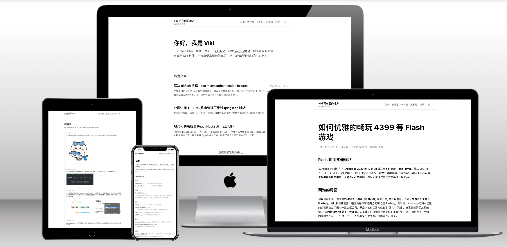

# Viki 的博客

[](https://nextjs.org/)
[](https://react.dev/)
[](https://www.typescriptlang.org/)
[](https://tailwindcss.com/)

一个基于 **Next.js 16**、**React 19** 和 **Tailwind CSS v4** 构建的现代化个人博客。

> 生活需要记录



---

## 💻 预览

- 网址: [https://blog.viki.moe](https://blog.viki.moe)

## ✨ 特性

### 🚀 现代化技术栈

- **Next.js 16** - App Router + 混合渲染（静态生成 + 动态 API）
- **React 19** - Server Components + React Compiler
- **Tailwind CSS v4** - CSS-first 配置，OKLCH 色彩空间
- **TypeScript 5.9+** - 完整的类型安全
- **pnpm 10.25+** - 高效的包管理器

### 📝 内容管理

- **纯 Markdown** - 使用 `.md` 文件，按年份组织（2019-2026），非 MDX
- **Unified 生态** - 基于 remark + rehype 的 Markdown 处理管线
  - `parseMarkdown()` - 短内容（碎碎念、Mio 说），启用换行符处理
  - `parseArticle()` - 长文章，支持标题锚点、代码高亮
- **Shiki 双主题** - `one-light` 和 `one-dark-pro` 自动切换的代码高亮
- **自定义插件** - 剧透语法 `||text||`、图片缩放、外部链接处理
- **LRU 缓存** - 最多缓存 500 条 HTML 输出，提升性能
- **Front Matter** - 灵活的文章元数据（标题、日期、摘要、标签、置顶等）
- **多页面支持** - 首页、文章归档、文章详情、大事记、碎碎念、Mio 说、关于页等

### 🎨 设计与体验

- **设计风格** - 扁平化设计，极简主义，严格的黑白灰色调
  - 无阴影设计（`box-shadow: none`）
  - 使用边框和背景色分隔元素
  - 小圆角（2px - 6px）
- **主题系统** - 亮色/暗色/跟随系统三模式切换，基于 `next-themes`
- **OKLCH 色彩空间** - 感知均匀的现代色彩系统，更接近人眼视觉
- **响应式布局** - 完美适配桌面、平板、手机
- **平滑动画** - 主题切换、页面滚动、图片缩放等交互反馈
- **系统字体栈** - 零字体加载，原生阅读体验

### 🔍 SEO 与性能优化

- **动态 OG 图片** - 基于 `@vercel/og` 的社交分享卡片，构建时预生成
  - 文章页：显示标题、日期、阅读时间、摘要
  - 首页：显示统计数据（文章数、碎碎念数等）
  - 使用自定义字体（思源黑体）
- **结构化数据** - JSON-LD 格式的 BlogPosting 和 BreadcrumbList Schema
- **智能推荐算法** - 多维度加权评分（标签相似度 40% + 时间新鲜度 30% + 时间接近度 20% + 确定性随机 10%）
- **RSS Feed** - 完整的 RSS 2.0 支持（`/rss`），最新 20 篇文章，1 小时缓存
- **混合渲染** - 静态生成（SSG）+ 增量静态生成（ISR）
- **预连接优化** - 关键域名 DNS 预解析和预连接
- **Robots.txt** - 搜索引擎爬虫配置
- **PWA Manifest** - 渐进式 Web 应用支持
- **Google Analytics** - 访问统计和用户行为分析

---

## 🛠️ 技术栈

### 核心框架

- **[Next.js 16](https://nextjs.org/)** - React 框架，App Router
- **[React 19](https://react.dev/)** - UI 库，Server Components
- **[TypeScript 5.9+](https://www.typescriptlang.org/)** - 类型安全
- **[Tailwind CSS 4.1](https://tailwindcss.com/)** - CSS 框架

### 内容处理

- **[gray-matter](https://github.com/jonschlinkert/gray-matter)** - Front matter 解析
- **[Shiki](https://shiki.style/)** - 代码语法高亮
- **[unified](https://unifiedjs.com/)** - Markdown 处理生态系统
- **[remark](https://github.com/remarkjs/remark)** - Markdown 解析器
- **[rehype](https://github.com/rehypejs/rehype)** - HTML 处理器

### 工具库

- **[dayjs](https://day.js.org/)** - 日期处理
- **[Feed](https://github.com/jpmonette/feed)** - RSS/Atom feed 生成
- **[@vercel/og](https://vercel.com/docs/functions/og-image-generation)** - OG 图片生成
- **[medium-zoom](https://github.com/francoischalifour/medium-zoom)** - 图片缩放
- **[@next/bundle-analyzer](https://www.npmjs.com/package/@next/bundle-analyzer)** - 打包分析
- **[Google Analytics](https://analytics.google.com/)** - 网站访问统计

### 开发工具

- **[pnpm](https://pnpm.io/)** - 包管理器（10.25+）
- **[Prettier](https://prettier.io/)** - 代码格式化（无分号、单引号、尾随逗号）
- **[ESLint](https://eslint.org/)** - 代码检查
- **[Vitest](https://vitest.dev/)** - 单元测试框架
- **React Compiler** - 自动性能优化

---

## 🚀 快速开始

### 环境要求

- **Node.js** 20+
- **pnpm** 10.25+

### 安装

```bash
# 克隆仓库
git clone https://github.com/vikiboss/blog.git
cd blog

# 安装依赖
pnpm install
```

### 开发

```bash
# 启动开发服务器（使用 Turbopack）
pnpm dev

# 访问 http://localhost:3000
```

### 构建

```bash
# 生产构建
pnpm build

# 静态文件输出到 out/ 目录
```

### 其他命令

```bash
# 类型检查
pnpm type-check

# 代码格式化
pnpm format

# 打包分析
pnpm analyze
```

---

## 🚢 部署

### Vercel（推荐）

[](https://vercel.com/new)

1. 点击上方按钮
2. 导入 Git 仓库
3. 自动部署

### 其他静态托管

构建后，将 `out/` 目录部署到:

- **GitHub Pages** - 免费，集成 Git
- **Cloudflare Pages** - 全球 CDN，快速
- **Netlify** - 简单易用
- **任何支持静态文件的服务**

---

## 🤝 贡献

欢迎贡献代码、报告问题或提出建议！请查看 [.claude/CLAUDE.md](./.claude/CLAUDE.md) 了解开发规范。

---

## 📄 许可证

本项目采用 MIT 许可证

---

## 🙏 致谢

### 技术

- [Next.js](https://nextjs.org/) - 卓越的 React 框架
- [React](https://react.dev/) - 强大的 UI 库
- [Tailwind CSS](https://tailwindcss.com/) - 实用优先的 CSS 框架
- [Shiki](https://shiki.style/) - 美观的代码高亮

---

## 📧 联系

- **GitHub**: [@vikiboss](https://github.com/vikiboss)
- **Email**: hi@viki.moe
- **网站**: https://blog.viki.moe

---

**⭐ 如果这个项目对你有帮助，欢迎 Star～**

---

<p align="center">
  使用 ❤️ 和 <a href="https://nextjs.org">Next.js</a> 构建
</p>
